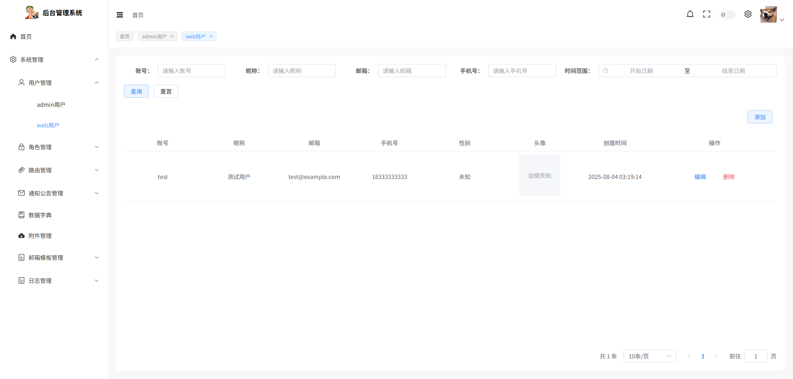
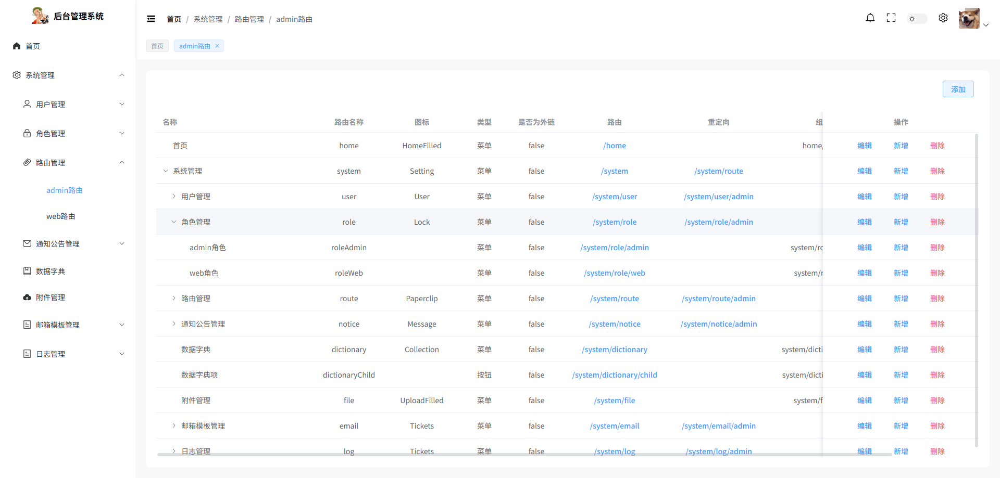

# admin-vue3-ts

> vue3+ts开发的后台管理系统
>
> 预览地址：https://admin-vue3-ts.is-an.ai/


## 技术栈

- Vue3
- TypeScript
- Vite
- pinia
- axios
- crypto-js
- socket.io-client
- element-plus
- 等等


## 功能

- 登录
  - 账号密码
  - 邮箱验证码

- 错误页面
- 用户管理
- 角色管理
- 路由管理
- 日志管理
- 数据字典
- 通知公告
- 附件管理
- 邮箱模板管理
- 等等


## 环境

> 设置了开发环境和生成环境的.env


## 项目设置

```sh
npm install
```

### 编译和热重载开发

> serve开发环境、dev生产环境、start生产环境打开浏览器

```sh
npm run serve

npm run dev

npm run start
```

### 打包

> 默认是生产环境

```sh
npm run build

npm run build:dev
```


## Docker部署

> 使用了GitHub自动化上传到了Docker hub

```
docker pull 766187397/admin-vue3-ts:latest
```


## 截图





